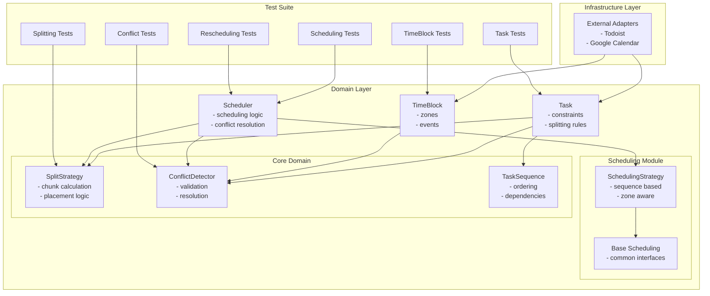

@ARCH

The architecture shows mature understanding of:
- Separation of concerns
- Business domain isolation
- External service adaptation
- Testing best practices

```mermaid
graph TD
%% Domain Layer
subgraph Domain["Domain Layer"]
Task["`Task
        - constraints
        - splitting rules`"]
TimeBlock["`TimeBlock
        - zones
        - events`"]
Scheduler["`Scheduler
        - scheduling logic
        - conflict resolution`"]

        subgraph Scheduling["Scheduling Module"]
            Strategy["`SchedulingStrategy
            - sequence based
            - zone aware`"]
            Base["`Base Scheduling
            - common interfaces`"]
        end
        
        subgraph Core["Core Domain"]
            Splitting["`SplitStrategy
            - chunk calculation
            - placement logic`"]
            Conflict["`ConflictDetector
            - validation
            - resolution`"]
            Sequence["`TaskSequence
            - ordering
            - dependencies`"]
        end
    end

    %% Infrastructure Layer
    subgraph Infrastructure["Infrastructure Layer"]
        Adapters["`External Adapters
        - Todoist
        - Google Calendar`"]
    end

    %% Test Layer
    subgraph Tests["Test Suite"]
        TaskTests["Task Tests"]
        TimeBlockTests["TimeBlock Tests"]
        SchedulingTests["Scheduling Tests"]
        ConflictTests["Conflict Tests"]
        SplittingTests["Splitting Tests"]
        ReschedulingTests["Rescheduling Tests"]
    end

    %% Relationships
    Task --> Splitting
    Task --> Conflict
    Task --> Sequence
    TimeBlock --> Conflict
    Strategy --> Base
    Scheduler --> Strategy
    Scheduler --> Conflict
    Scheduler --> Splitting
    Adapters --> Task
    Adapters --> TimeBlock

    %% Test Dependencies
    TaskTests --> Task
    TimeBlockTests --> TimeBlock
    SchedulingTests --> Scheduler
    ConflictTests --> Conflict
    SplittingTests --> Splitting
    ReschedulingTests --> Scheduler
```