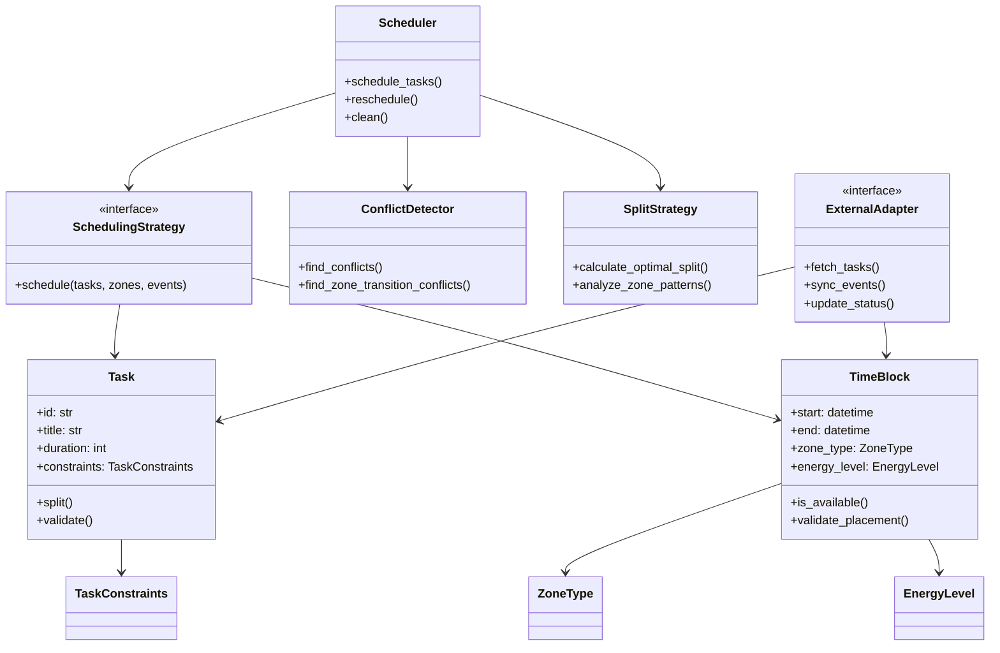

```mermaid
classDiagram
class Task {
+id: str
+title: str
+duration: int
+constraints: TaskConstraints
+split()
+validate()
}

    class TimeBlock {
        +start: datetime
        +end: datetime
        +zone_type: ZoneType
        +energy_level: EnergyLevel
        +is_available()
        +validate_placement()
    }

    class SchedulingStrategy {
        <<interface>>
        +schedule(tasks, zones, events)
    }

    class ConflictDetector {
        +find_conflicts()
        +find_zone_transition_conflicts()
    }

    class SplitStrategy {
        +calculate_optimal_split()
        +analyze_zone_patterns()
    }

    class Scheduler {
        +schedule_tasks()
        +reschedule()
        +clean()
    }

    class ExternalAdapter {
        <<interface>>
        +fetch_tasks()
        +sync_events()
        +update_status()
    }

    Task --> TaskConstraints
    TimeBlock --> ZoneType
    TimeBlock --> EnergyLevel
    Scheduler --> SchedulingStrategy
    Scheduler --> ConflictDetector
    Scheduler --> SplitStrategy
    SchedulingStrategy --> Task
    SchedulingStrategy --> TimeBlock
    ExternalAdapter --> Task
    ExternalAdapter --> TimeBlock
```