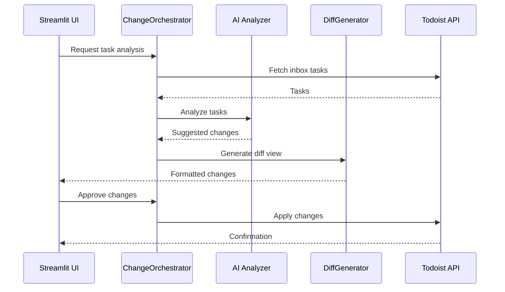
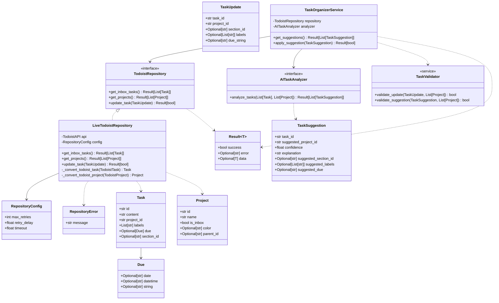

Let me help you envision a workflow that combines TaskFlow, AI, and your mobile Todoist usage. Here's how I imagine it could work effectively:


1. Task Capture Phase (Mobile):
- Throughout your day, you quickly capture tasks in your Todoist inbox using your mobile app
- You don't worry about organizing them at this point - just rapid capture
- You might add quick notes or context if needed

2. AI Processing Phase (TaskFlow):
- When you're ready (perhaps daily or every few days), you open TaskFlow on your computer
- The AI analyzes your inbox tasks looking for:
    * Task content and context
    * Any patterns or keywords
    * Time sensitivity
    * Task complexity
    * Related tasks

3. Smart Organization Phase:
- AI suggests appropriate projects for each task based on:
    * Your existing project structure
    * Similar tasks you've categorized before
    * Task characteristics (work vs personal, urgent vs planning, etc.)
- You get a clean interface showing:
    * Task content
    * AI-suggested project
    * Confidence level of the suggestion
    * Alternative project suggestions

4. Review & Confirm Phase:
- You can quickly review AI suggestions in the AgGrid interface
- Bulk accept correct suggestions
- Manually adjust any misclassified tasks
- Add additional context or labels if needed





I'll outline the implementation order with test cases, following the outside-in TDD approach while maintaining the ability to work with isolated components.

1. ✅ **Core Domain Objects (Value Objects)**
```python
# Test cases for Task ✅
- should create task with minimal required fields
- should create task with all optional fields
- should not allow modification after creation
- should properly handle None values for optional fields

# Test cases for TaskUpdate ✅
- should create update with minimal required fields
- should validate project_id is not empty
- should handle optional fields properly
```

2. ✅ **Result Type (Infrastructure)**
```python
# Test cases for Result ✅
- should create success result with data
- should create error result with message
- should handle None data for success case
- should provide type safety for generic data
- should be immutable after creation
```

3. ✅ **TodoistRepository Interface with Mock Implementation**
```python
# Test cases for MockTodoistRepository ✅
- should return inbox tasks only
- should return all projects
- should handle empty lists
- should return proper Result types
- should simulate network errors
- should track update operations
```

4. ✅ **TaskValidator**
```python
# Test cases for TaskValidator ✅
- should validate task update against available projects
- should reject updates with non-existent project_id
- should validate section_id belongs to project
- should validate labels exist
- should handle empty/None optional fields
```

5. **LiveTodoistRepository**
```python
# Test cases for LiveTodoistRepository
- should connect to Todoist API (integration test)
- should handle API errors gracefully
- should convert Todoist tasks to domain Tasks
- should convert Todoist projects to domain Projects
- should respect retry configuration
- should handle rate limiting
- should maintain task field values during update
```

6. **AITaskAnalyzer Interface with Mock Implementation**
```python
# Test cases for MockAIAnalyzer
- should analyze task content and suggest project
- should provide confidence score
- should provide meaningful explanation
- should handle empty task list
- should respect existing task patterns
- should simulate AI service errors
```

7. **TaskOrganizerService**
```python
# Test cases for TaskOrganizerService
- should get suggestions for inbox tasks
- should handle empty inbox
- should apply valid suggestions
- should reject low confidence suggestions
- should maintain task integrity during updates
- should handle repository errors
- should handle analyzer errors
```

8. **Real AI Implementation**
```python
# Test cases for OpenAI/Anthropic Analyzer
- should generate valid prompts
- should parse AI responses correctly
- should handle API errors
- should respect token limits
- should maintain context in suggestions
- should provide consistent confidence scores
```

Implementation Order Notes:
1. Start with core domain objects as they're used everywhere
2. Build Result type early as it's used in all interfaces
3. Create Mock repository to enable service development
4. Implement validation before real repository
5. Build service with mock dependencies
6. Add real implementations last

Testing Approach:
1. Unit tests for all components
2. Integration tests for repository and AI service
3. End-to-end tests for complete workflows
4. Performance tests for batch operations

Development Process:
1. Write failing test
2. Implement minimal code to pass
3. Refactor while maintaining test coverage
4. Document public interfaces
5. Add error cases
6. Improve error handling
7. Add logging
8. Performance optimization


Would you like me to start with implementing any specific component or elaborate on any test cases?